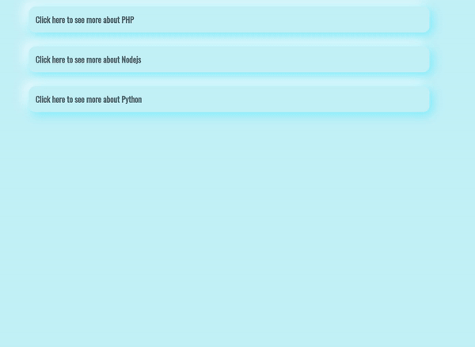

# Accordion Project 

This is a simple project in order to get better at typescript. 

Learning typescript can get you a better understand about javacript.

It was needed cast conversion in order to get rid of some errors about classList do not available on node elements.

## Technologies behind it

- HTML5 https://user-images.githubusercontent.com/25181517/192158954-f88b5814-d510-4564-b285-dff7d6400dad.png
- CCS3  https://user-images.githubusercontent.com/25181517/183898674-75a4a1b1-f960-4ea9-abcb-637170a00a75.png
- SASS  https://user-images.githubusercontent.com/25181517/192158956-48192682-23d5-4bfc-9dfb-6511ade346bc.png
- JS    https://user-images.githubusercontent.com/25181517/117447155-6a868a00-af3d-11eb-9cfe-245df15c9f3f.png
- Typescript https://user-images.githubusercontent.com/25181517/183890598-19a0ac2d-e88a-4005-a8df-1ee36782fde1.png
- Editor VSCode https://user-images.githubusercontent.com/25181517/192108891-d86b6220-e232-423a-bf5f-90903e6887c3.png

### Final result

